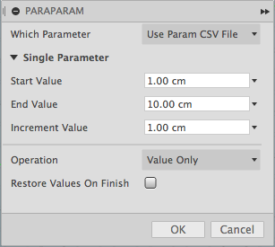
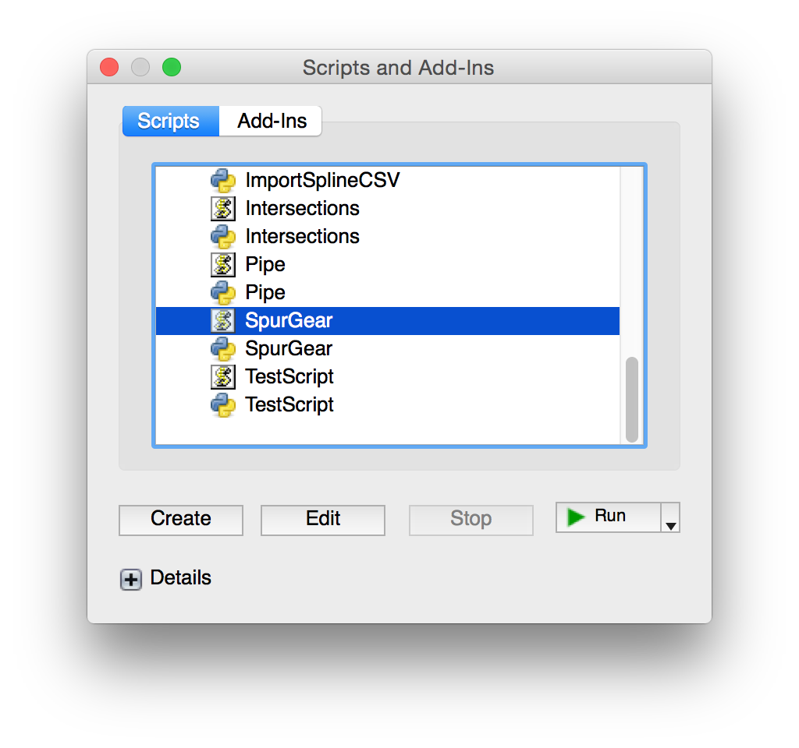
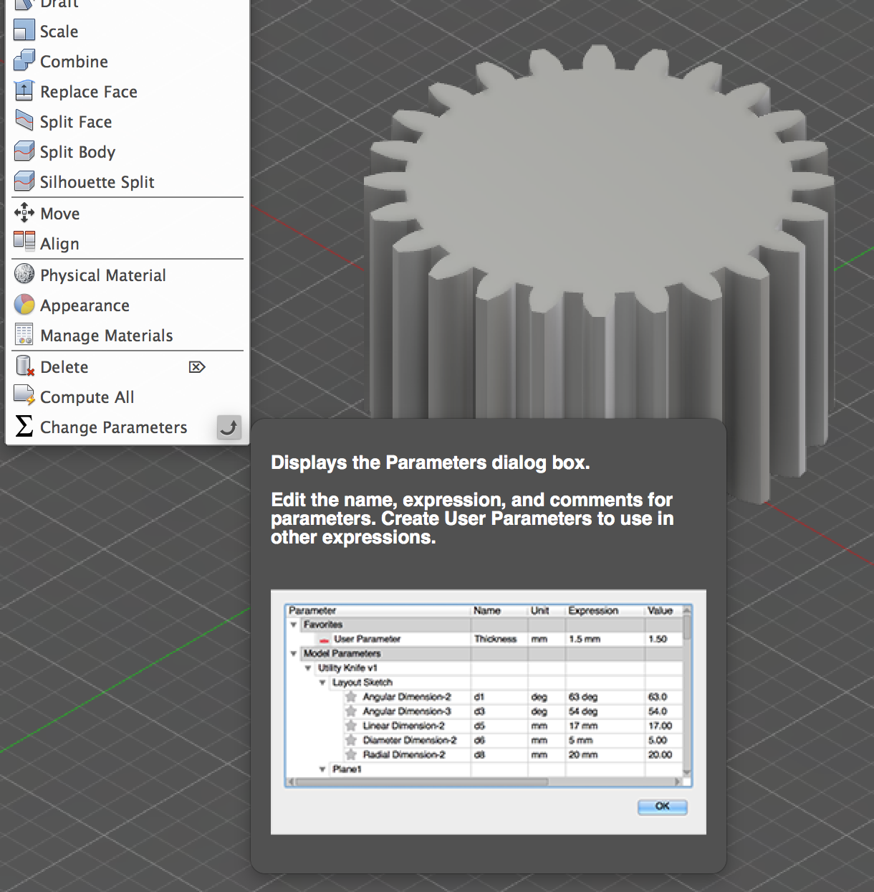
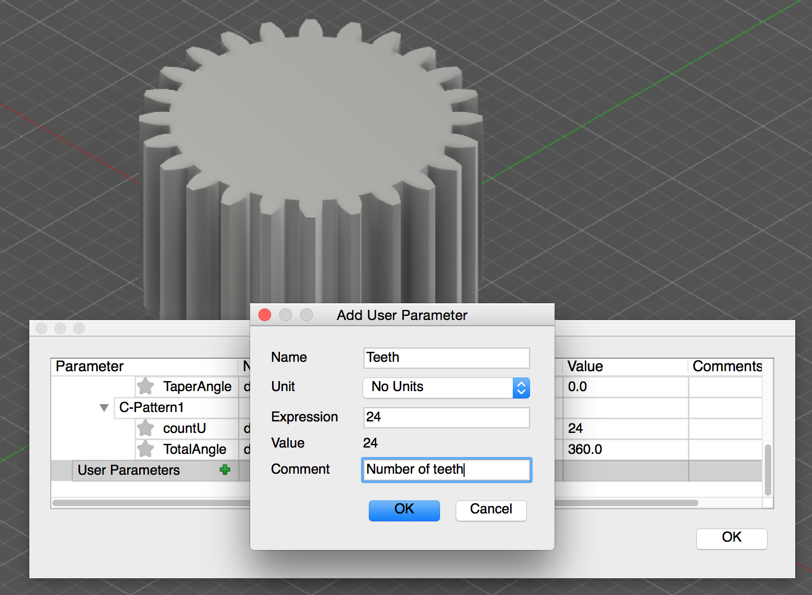
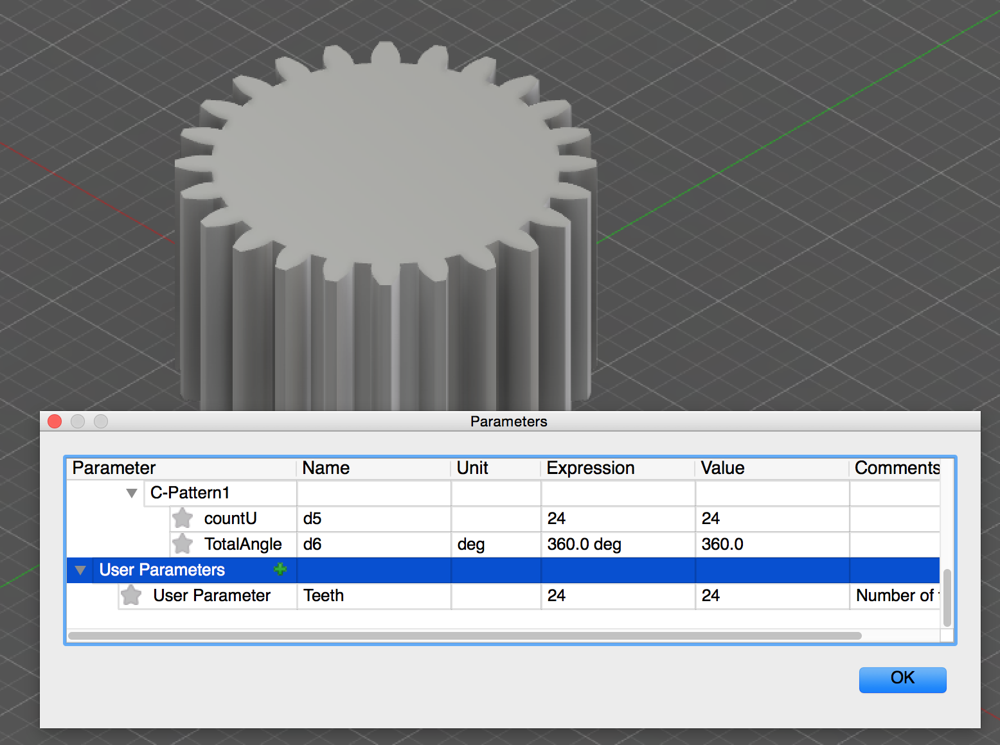
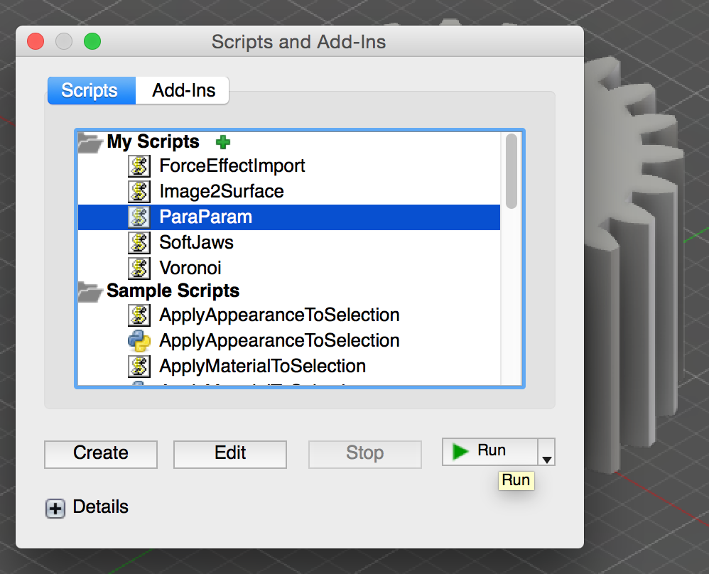
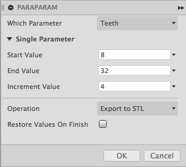
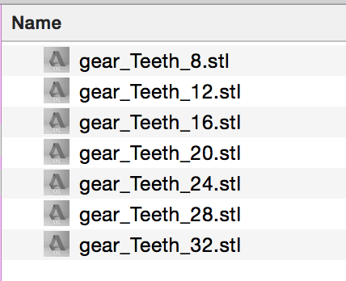

#  Fusion360ParaParam

This script is used for parametrically modifying a user parameter.  For each iteration an operation may be performed such as exporting to STL.  This is very useful for automating variations of a design and exporting those variations.

*NOTE* The set of operations are limited in this initial release.  More added later.

![Image of ParaParam Dialog]
(./resources/ParaParams-Step-7-ParaParam-Dialog.png)

## Installation

Copy the "Fusion360ParaParams" folder into your Fusion 360 "My Scripts" folder. You may find this folder using the following steps:

1. Start Fusion 360 and then select the File -> "Scripts and Add-Ins..." menu item
2. The Scripts and Add-Ins dialog will appear and display the "My Scripts" and "Sample Scripts" folders
3. Select one of the "My Scripts" files and then click on the "+" Details icon near the bottom of the dialog.
  - If there are no files in the "My Scripts" folder then create a default one by clicking the Create button, select JavaScript, and then OK.
4. With a user script selected and the "Details" section expanded, look at the Full Path value.  This contains the location of the user scripts folder.
5. Copy this script's folder into that location.
  For example, on my Mac the folder is located in:
    /Users/USERNAME/Library/Application Support/Autodesk/Autodesk Fusion 360/API/Scripts
  And on Windows:
    C:\users\USERNAME\AppData\Roaming\Autodesk\Autodesk Fusion 360\API\Scripts
6. Now add the script to the lists of "My Scripts"
7. Click the "+" icon next to the "my Scripts" item
  - The "Add new script" dialog should appear.
8. Locate the ParaParams.js file in the folder you copied, select it, and click Open. The script should now be installed and ready to be run.

The script should be ready to run.

## Usage

1. Run the "ParaParam" script from the Script Manager
2. The settings dialog will be shown.  Adjust to your preferences:

  

  - Which Parameter :
    - Select the single user parameter or optionally a CSV file containing multiple parameters to modify
  - Single Parameter
    - Start Value : Initial value
    - End Value : Last value
    - Increment Value : The amount to increment each iteration
  - Operation: Select the operation to perform each iteration
    - Value Only : Only change the parameter value
    - Export to _Type_ : Export the design to specified file type
  - Restore Values On Finish : Will restore the original parameter values once finished.
3. Click OK to begin

Note, after the script has run the design changes may be undone using Edit -> Undo.  Or, checkmark the "Restore Values On Finish".

### CSV Parameters

A comma separated value (CSV) file may be used to specify which parameters and values to change.  The format of the file is:

<pre>Parameter Name, Start Value, End Value, Step/Increment Value</pre>

For example, the following would modify the "Diameter" and "Height" parameters for all combinations of values:

<pre>
Diameter,1,5,2
Height,1,3,0.5
</pre>

### Iterations

The start, end, and step/increment values define the iteration and the values that are assigned to the selected user parameter. For example, if your design has a user parameter "Height" that you would like to set to values from 1 to 4 inches every 0.5 inches then you would specify:

- Start Value = 1 in
- End Value = 4 in
- Increment Value = 0.5 in

That will assign the sequence of values [1, 1.5, 2, 2.5, 3, 3.5, 4] to the "Height" user parameter.

If you would like to iterate in reverse then specify a start value larger than the end value but use a positive increment.  For example:

- Start Value = 4 in
- End Value = 1 in
- Increment Value = 1.0 in

That will assign the values [4, 3, 2, 1] to the user parameter.

In essence, this is performing a [For loop](http://en.wikipedia.org/wiki/For_loop).

### Export Operation

The current design may be exported after each iteration. When one of the export operations is selected, the script will prompt for a filename prefix to use for export.  The filename prefix also defines the folder to use for each exported file.  For each iteration the specified filename prefix has the user parameter names as well as the current iteration values appended to it.

For example, if exporting STL with a filename of "MyModel" and the following settings:

- Parameter Name = "Height"
- Start Value = 1 in
- End Value = 4 in
- Increment Value = 1 in

Then the filenames produced would be:

- "MyModel_Height_1.stl"
- "MyModel_Height_2.stl"
- "MyModel_Height_3.stl"
- "MyModel_Height_4.stl"

### Example Usage

Here is an example of using the script to export several variations of a design.

1. Start Fusion 360
2. In a new document, run the SpurGear (Javascript) script and use the default values to generate the gear.

  

3. Display the Change Parameters dialog after the gear has been created.

  

4. In the dialog, click the green '+' icon next to the User Parameters category.
5. In the Add User Parameter dialog, set the name to "Teeth", unit to "No Unit", expression to 24, then click OK.

  
  

6. Now change the "countU" model parameter's expression to "Teeth"

  

  The model parameter is now being driven by the "Teeth" user parameter.
7. Click the OK button to close the parameters dialog.
8. Run the ParaParam script

  

9. In the settings dialog, select the "Teeth" parameter name, start value of 8, end value of 32, increment of 4, and operation to "Export to STL".

  

10. Click OK to start the ball rolling
11. Since an export operation was selected the script will prompt for a filename to export to.  Choose a folder and then enter a filename that will be the prefix.  Don't include an extension.  For example, create a new folder named "SpurGears" and then enter the filename prefix "Gear".  Click OK.
12. The script should finish and the specified folder will now contain a series of STL files.  Each file containing the state of the design for at the specific iteration.

  

To restore the the parameter values changed by the addin, select Edit -> Undo.  Or, checkmark the "Restore Values On Finish" in the script dialog.

## Sample File

There's also a sample model file "ParaParamSample.f3d" and parameters file "ParaParamSample.csv" in the script folder.  The model contains a cylinder and torus that may be driven with user parameters.  The CSV file contains the parameters and may be selected when the ParaParam script is run.  This will cause the "Height" and "Diameter" values to be modified.

## Issues

- When exporting files, there isn't a check for overwriting of existing files with the same names.
