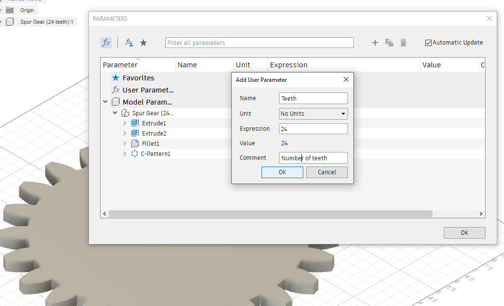

#  Fusion 360 ParaParam

This script is used for parametrically modifying user parameters.

It supports manually entering a range of values to iterate over for a specific user parameter.  Or, selecting a CSV file that may contain multiple user parameter names and the values for iteration.

For each iteration an operation may be performed such as exporting to STL.  This is very useful for automating variations of a design and exporting those variations.

![Image of ParaParam Dialog]
(./resources/ParaParams-Step-07-ParaParam-Dialog.png)

## Installation

Please see the most recent install instructions here:

https://knowledge.autodesk.com/support/fusion-360/troubleshooting/caas/sfdcarticles/sfdcarticles/How-to-install-an-ADD-IN-and-Script-in-Fusion-360.html 

If you are installing manually, then please download the archive file (ZIP) from Github by clicking on the "Clone or download" button and then selecting "Download ZIP".

Once you have the ZIP file, please follow the manual install instructions in the link above.

## Usage

1. Run the "ParaParam" script from the Add-Ins Manager
2. The ParaParam settings dialog will be shown.  Adjust to your preferences:

  

  - Which Parameter :
    - Select either a user parameter or the CSV File option
      - Single User Parameter
        - Start Value : Initial value
        - End Value : Last value
        - Increment Value : The amount to increment each iteration
      - CSV File
        - A file dialog will be displayed to allow selecting the CSV file
  - Operation: Select the operation to perform each iteration
    - Value Only : Only change the parameter value
    - Export to _Type_ : Export the design to specified file type
  - Export STL for each body : When "Export to STL" is selected and this is checked, an STL is generated for each body.  If there are no bodies, this exports the entire model as STL (as if this option not checked)
  - Restore Values On Finish : Will restore the original parameter values once finished.
3. Click OK to begin

Note, after the script has run the design changes may be undone using Edit -> Undo.  Or, checkmark the "Restore Values On Finish".

IMPORTANT: When exporting files, there isn't a check for overwriting of existing files with the same names.

### CSV File

A comma separated value (CSV) file may be used to specify which parameters and values to change.  The format of the file is:

<pre>Parameter Name, Start Value, End Value, Step/Increment Value</pre>

For example, the following would modify the "Diameter" and "Height" parameters for all combinations of values:

<pre>
Diameter,1,5,2
Height,1,3,0.5
</pre>

### Iterations

The start, end, and step/increment values define the iteration and the values that are assigned to the selected user parameter. For example, if your design has a user parameter "Height" that you would like to set to values from 1 to 4 inches every 0.5 inches then you would specify:

- Start Value = 1 in
- End Value = 4 in
- Increment Value = 0.5 in

That will assign the sequence of values [1, 1.5, 2, 2.5, 3, 3.5, 4] to the "Height" user parameter.

If you would like to iterate in reverse then specify a start value larger than the end value but use a positive increment.  For example:

- Start Value = 4 in
- End Value = 1 in
- Increment Value = 1.0 in

That will assign the values [4, 3, 2, 1] to the user parameter.

In essence, this is performing a [For loop](http://en.wikipedia.org/wiki/For_loop).

### Export Operation

The current design may be exported after each iteration. When one of the export operations is selected, the script will prompt for a folder to use for export.  For each iteration, a filename is generated which contains the current document name, user parameter names, as well as the current iteration values appended to it.

For example, if exporting STL with a document name of "MyModel" and the following settings:

- Parameter Name = "Height"
- Start Value = 1 in
- End Value = 4 in
- Increment Value = 1 in

Then the filenames produced would be:

- "MyModel_Height_1.stl"
- "MyModel_Height_2.stl"
- "MyModel_Height_3.stl"
- "MyModel_Height_4.stl"

### Example Usage

Here is an example of using the script to export several variations of a design.

1. Start Fusion 360
2. In a new document, run the SpurGear script and use the default values to generate the gear.

  

3. Display the Change Parameters dialog after the gear has been created.

  

4. In the dialog, click the '+' button to add a User Parameter.
5. In the Add User Parameter dialog, set the name to "Teeth", unit to "No Units", expression to 24, then click OK.

  

6. Now change the "countU" model parameter's expression to "Teeth"

  
  The model parameter is now being driven by the "Teeth" user parameter.

7. Click the OK button to close the parameters dialog.
8. Run the ParaParam script

  

9. In the settings dialog, select the "Teeth" parameter name, start value of 16, end value of 32, increment of 4, and operation to "Export to STL".

  

10. Click OK to start the ball rolling
11. Since an export operation was selected the script will prompt for a folder to export into.  Click OK.
12. The script will run and when finished, the specified folder will now contain a series of STL files.  Each file will contain the state of the design for the specific iteration.

  

To restore the parameter values changed by the script, select Edit -> Undo.  Or, checkmark the "Restore Values On Finish" in the script dialog.

## Sample File

There's a sample model file "ParaParamSample.f3d" and parameters file "ParaParamSample.csv" in the script folder.  The model contains a cylinder that may be driven with user parameters.  The CSV file contains the parameters and may be selected when the ParaParam script is run.  This will cause the "Height" and "Diameter" values to be modified. If you select to export STL when you run this, the export folder will be filled with 15 files, one for each iteration:

- ParaParamSample_Diameter_1.0_in_Height_1.0.stl
- ParaParamSample_Diameter_1.0_in_Height_1.5.stl
- ...
- ParaParamSample_Diameter_5.0_in_Height_2.5.stl
- ParaParamSample_Diameter_5.0_in_Height_3.0.stl

## Issues

- When exporting files, there isn't a check for overwriting of existing files with the same names.
